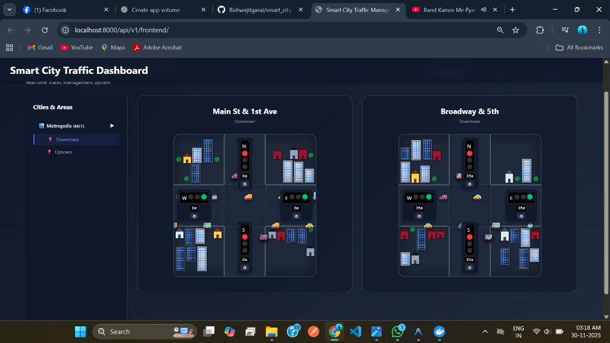
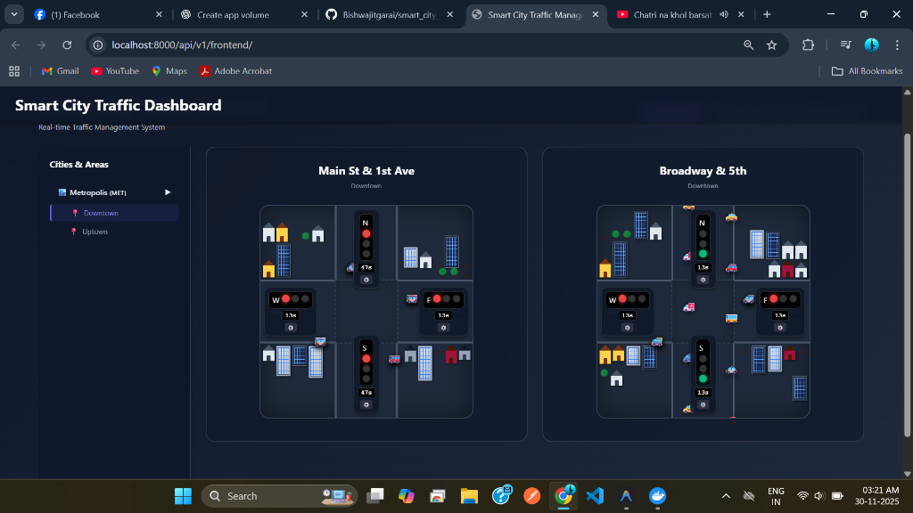
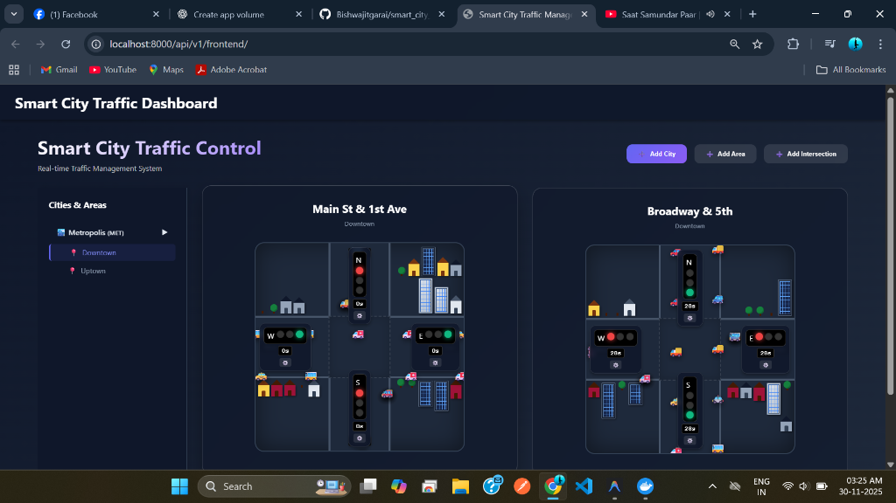
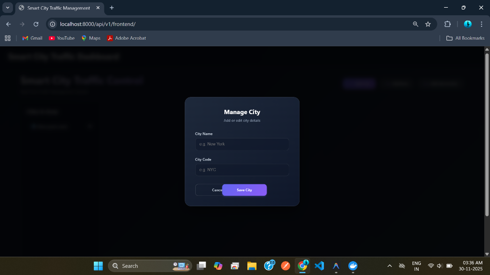

# 🚦 Smart City Traffic Management System



A next-generation traffic control system built with **FastAPI**, **Redis**, and **Vanilla JS**. Designed for real-time traffic simulation, manual overrides, and adaptive control logic.

## 🚀 Quick Start

This project uses **uv** for ultra-fast dependency management.

### Prerequisites
- Python 3.12+
- Docker (for Redis)
- `uv` (Install via `pip install uv`)

### 1. Start Infrastructure
Start the Redis instance using Docker:
```bash
docker-compose up -d
```

### 2. Install Dependencies
Sync the project environment:
```bash
uv sync
```

### 3. Run the Application
Launch the server with hot-reloading:
```bash
uv run main.py
```

Access the dashboard at: **http://localhost:8001/api/v1/frontend/**

---

## 🌟 Key Features

### 1. Real-Time Traffic Visualization
Watch cars move through intersections with smooth animations. The system tracks individual vehicles and updates their position in real-time via WebSockets.



### 2. Smart Manual Control
Take control of any intersection. The system includes **"Smart Switching"** logic:
- **Red -> Green**: Automatically turns conflicting lights RED.
- **Green -> Red**: Automatically turns conflicting lights GREEN.
- **Cycle Alignment**: Manual overrides sync with the background cycle for smooth transitions.



### 3. City, Area & Intersection Management
The system provides a unified interface to manage your city's hierarchy. You can easily add and configure:
- **Cities**: The top-level administrative units.
- **Areas**: Distinct zones within a city for granular control.
- **Intersections**: Traffic nodes with precise coordinate placement.

All management forms use a consistent, modern modal UI.



---

## 🛠️ Architecture

- **Backend**: FastAPI (Python)
- **Database**: SQLite + SQLAlchemy (Async)
- **State Management**: Redis (Real-time phase tracking)
- **Frontend**: HTML5, CSS3 (Glassmorphism), Vanilla JS
- **Communication**: WebSockets (State broadcasting)

## 🎮 Usage Guide

### Dashboard Navigation
1.  **Sidebar**: Browse Cities and Areas. Click to filter the view.
2.  **Intersection Cards**: View real-time status of each intersection.

### Manual Override
1.  Click the **"⚙️ Manage"** button on any intersection.
2.  Select a direction (N/S or E/W).
3.  Choose a status (Red/Green/Yellow).
4.  Set a duration (e.g., 30s).
5.  Click **"Apply Override"**.
    *   *Note: The system will automatically handle conflicting lights to prevent accidents.*

### System Reset
If you need to wipe the database and start fresh:
```bash
uv run reset_system.py
```

## 🐛 Troubleshooting

### Port Conflicts
If port 8000 is busy, the app defaults to **8001**. Check the console output for the active URL.

### Redis Connection
Ensure Redis is running. If you see connection errors, restart the Docker container:
```bash
docker-compose restart redis
```

## 📝 License
MIT License

## 👤 Author
**Smart City Traffic Team**
*Building the future of urban mobility.*
